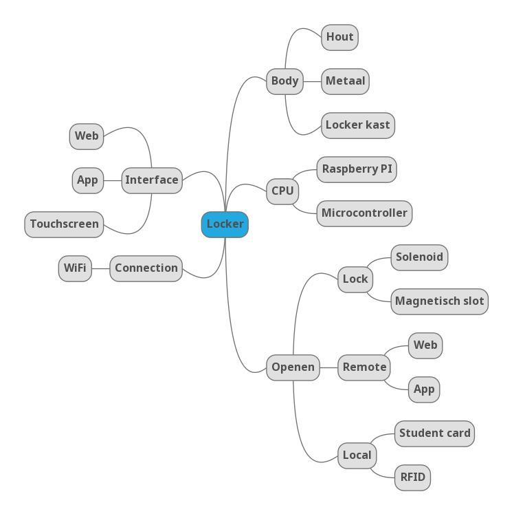

# Analyse

## Probleemstelling

> Eenvoudig uitlenen van materiaal, het voorkomen van diefstal of kwijtraken van materiaal.

* Materiaal achterlaten op locatie zonder monitoring
* Materiaal uitwisselen via een locker met een gedeelde key
* Bijhouden van access logs
* Ervoor zorgen dat alleen leerlingen met de juiste studentenkaart toegang hebben
* Koppelen van specifiek materiaal met een bepaalde locker
* Backup manier om te identificeren voor wanneer de user geen studentenkaart bij de hand heeft
* Mechanische manier om de locker te openen als elektronica niet wilt werken
* Betalingssysteem voorzien

## Mindmap

## Beschrijving


Een kast lockers met als centrale unit de Raspberry Pi.


De lockers zullen ontgrendeld kunnen worden aan de hand van de studentenkaart. Hierop staat een barcode deze wordt gescand via een barcode scanner. Hierdoor wordt je verder verwezen naar een web interface met de mogelijke lockers waar je toegang tot hebt.  Dit wordt allemaal getoond op een touchscreen scherm.

Het monitoren van de locker gebeurt met een sensor. Deze sensor stuurt een signaal wanneer de locker gesloten wordt. Via de web interface wordt de locker geopend. Hierdoor kunnen lockers een melding krijgen al ze vergeten hun locker te vergrendelen.

Gebruikers zouden via een applicatie hun studentenkaart aan hun gebruikersaccount kunnen koppelen. Bij een gebruikersaccount zouden we een maandelijkse of jaarlijkse kost op de locker kunnen instellen en deze laten betalen via Paypal, Apple Pay, Google Pay, Bancontact en dergelijke. 

Een web dashboard voor enkel administrators kan gebruikers zonder betalen access geven tot een locker. Lockers toevoegen aan het systeem, lockers openen, access logs opvragen en bekijken wie welke locker heeft gehuurd/gereserveerd.

## Hardware Analyse

Verschillende lockers mogelijk om aan te sluiten op 1 Raspberry Pi. Elke _"kast"_ van lockers heeft 2 Raspberry Pi's nodig, 1 voor de touchscreen en barcode scanner, de andere om de lockers op kunnen aan te sluiten \(solenoid en sensor\).

### Specificatie tabel

| Blok | Specificatie | Min | Max |
| :--- | :--- | :--- | :--- |
| Elektronisch slot | Werkspanning | 9V | 12V |
|  | Stroom | 500mA\(9V\) | 650mA\(12V\) |
|  | Totale stroom\(8 lockers\) | 4A | 5.2A |
| Reed sensor | Switching spanning | 6V | 200V |
|  | Stroom | 10mA | 1.25A |
| Raspberry PI 3B+ | Spanning | 5V | 5.1V |
|  | Stroom | 1.25 A | 3 A |

### Argumentatie tabel

| Blok | Argumentatie | Alternatieven |
| :--- | :--- | :--- |
| De raspberry PI 3B+ | De raspberry PI 3B+ beschikt al over een Wi-Fi verbinding. Deze heeft ook GPIO pinnen voor het aansluiten van de RFID reader en de touchscreen. | NanoPi Neo 4 |
| Netvoeding | Locker aansluiten met netvoeding en als backup met ups. Alle lockers bedraden. |  |
| RFID Reader | RFID wordt meer gebruikt voor het opslaan van materialen. | NFC |
| Touchscreen | Gebruiksgemak, visualisatie | Keypad |
| Elektronisch slot | Solenoid, veiliger omdat zelfs als de stroom uitvalt de locker deur nog steeds vergrendeld blijft waardoor alles wat erin zit veilig geborgen blijft, terwijl bij een magnetisch slot bij stroomuitval de locker deur open komt te staan | magnetisch slot |
| Reed sensor | De MK04 omdat deze bijna onzichtbaar is voor het oog. De werkspanning zijn veilig, hier komen we nooit van in de buurt. | 59140 RS |
| RGB Led | Makkelijk om iets te visualiseren, laag energieverbruik | Speaker, LCD |

## Software Analyse

### Data In- en Outputs

| Blok | Data In | Data Uit |
| :--- | :--- | :--- |
| Raspberry Pi | API calls\* | Digital Out |
| Web Server | API calls\* | API calls\* |
| Solenoid lock | 12 V | nvt. |
| Reed Sensor | nvt. | Digital HIGH/LOW |

### Api Calls



### State Diagram

