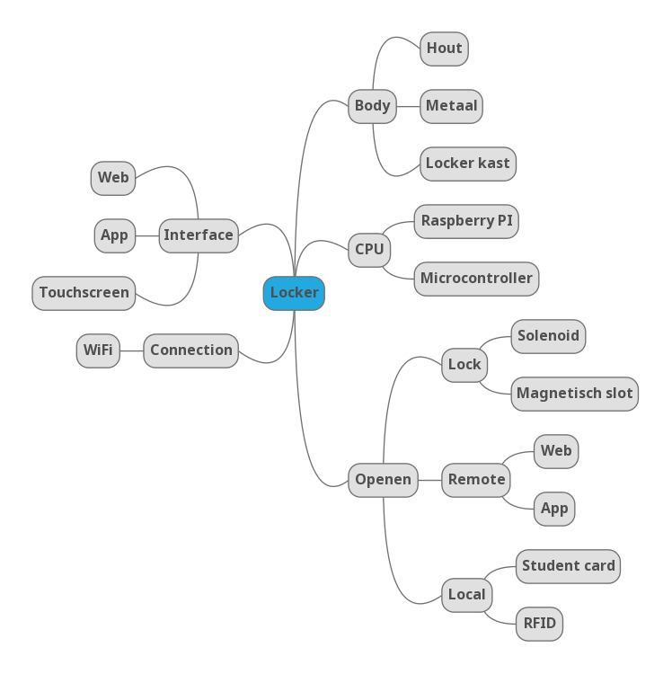
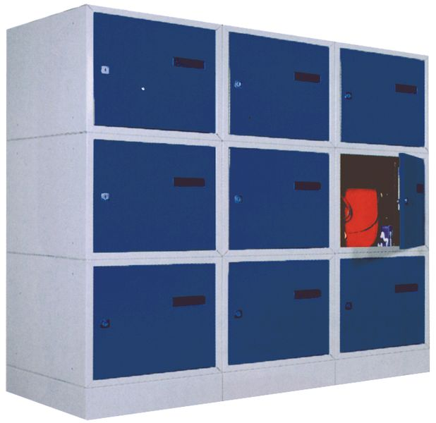
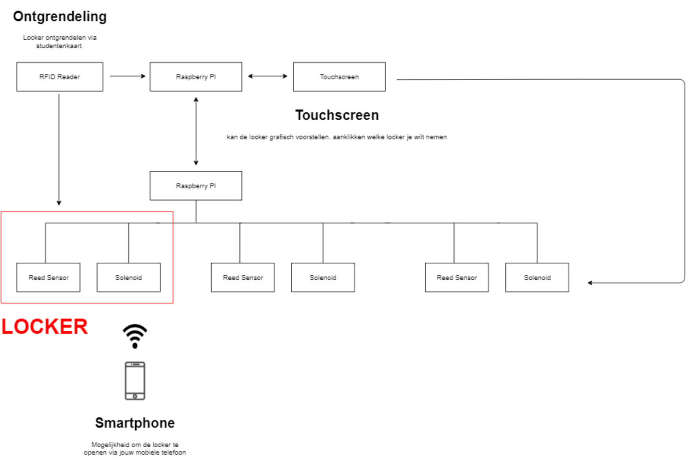
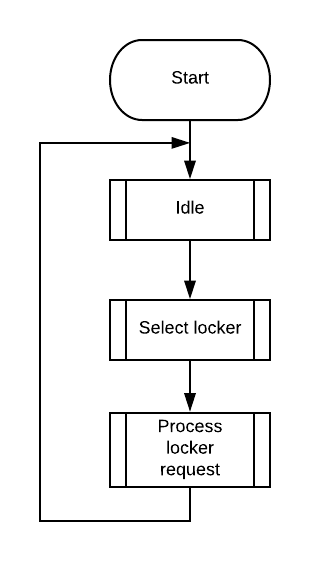
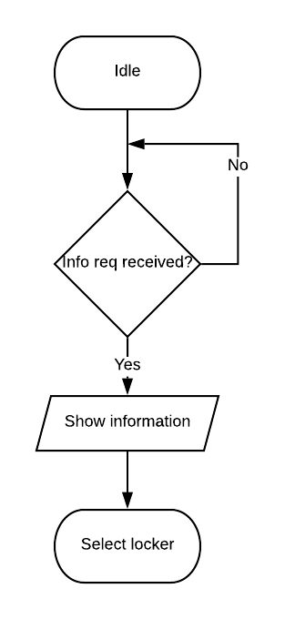

# Analyse

## Probleemstelling

Eenvoudig uitlenen van materiaal, het voorkomen van diefstal of kwijtraken van materiaal.

- Materiaal achterlaten op locatie zonder monitoring
- Materiaal uitwisselen via een locker met een gedeelde key
- Bijhouden van access logs
- Ervoor zorgen dat alleen leerlingen met juiste studentenkaart toegang hebben
- Koppelen van speciefiek materiaal (bv elektronica doos) met een bepaalde locker
- Backup manier om te identificeren voor wanneer de user geen studentenkaart bij de hand heeft
- Mechanische manier om locker te openen als elektronica niet wilt werken
- Gebruiker moet materiaal kunnen reserveren
- Bestalingssysteem voorzien

## Mindmap

## Beschrijving

Een kast lockers met als centrale unit de Raspberry PI. De lockers zullen ontgrendeld kunnen worden via een interface en studentenkaart. Deze interface zou een 
touchscreen, web application of een mobile application kunnen zijn. Via een web application kan de administrator nakijken wie welke locker huurt, welke lockers gereserveerd of in gebruik zijn.

Het monitoren van de locker gebeurt door een sensor. Hierdoor kunnen gebruikers een melding krijgen als ze vergeten zijn hun locker te 
vergrendelen. Gebruikers zouden via een applicatie makkelijk hun studentenkaart aan hun gebruikersaccount kunnen koppelen. Bij een gebruikersaccount zouden we een 
maandelijkse of jaarlijkse kost kunnen invoeren, en deze laten betalen via o.a. Apple Pay, Android Pay, Bancontact en dergelijke. 
Via het web dashboard waar enkel de administrator toegeng tot heeft kan een bepaalde locker geopend worden en kan men ook de access logs bekijken. 

Het identificeren van een locker zou aan de hand van een led zijn. Deze blinkt in een bepaald ritme als deze ontgrendeld is.

We hebben gekozen om al bestaande lockers te nemen en hier ons systeem in te installeren. De middelste locker als centrale unit te gebruiken waar de Raspberry PI, touchscreen en voeding zou komen. In de overige lockers gaan we de reed contacten en solenoid locks installeren.

## Hardware analyse

Locker kan ontgrendeld worden via studenten kaart en smartphone. Het kiezen welke locker je wilt openen gebeurd via touchsreen. Dit wordt bediend door 1 Raspberry PI die in verbinding is met een andere Raspberry PI die de reed contacten leest en de solenoid locks ontgrendeld.

### Specificatietabel
| Blok            | Specificatie  | Min     | Max |
|-----------      |---------------|-----    |-----|
|Elektronisch slot|Werkspanning   |9V       |12V  |
|                 |Stroom         |500mA(9V)|650mA(12V)|
|                 |Totale stroom(8 lockers)|4A|5.2A|
|Reed sensor      |Switching spanning|      |200V |
|                 |Stroom         |10mA     |1.25A|
|RFID RC522       |Stroom         |13mA     |26mA |
|                 |Spanning       |         |3.3V |
|                 |Card reading distance|0 mm| 60 mm|
|Raspberry PI 3B+ |Spanning       |5V       |5.1V |
|                 |Stroom         |1.25 A   |3 A  |

### Argumentatie tabel
| Blok          | Argumentatie       | Alternatieven          |
| ------------- | ------------- | -----             |
| De raspberry PI 3B+  | De raspberry PI 3B+ beschikt al over een Wi-Fi verbinding. Deze heeft ook GPIO pinnen voor het aansluiten van de RFID reader en de touchscreen.     | NanoPi Neo 4      |
| Netvoeding    | Locker aansluiten met netvoeding en als backup met ups. Alle lockers bedraden.         |          |
|RFID Reader | RFID wordt meer gebruikt voor het opslaan van materialen.          | NFC              |
| Touchscreen   | Gebruiksgemak, visualisatie           |Keypad  |
| Elektronisch slot| Solenoid, veiliger omdat zelfs als de stroom uitvalt de locker deur nog steeds vergrendeld blijft waardoor alles wat erin zit veilig geborgen blijft, terwijl bij een magnetisch slot bij stroomuitval de locker deur open komt te staan| magnetisch slot|
|Reed sensor| De MK04 omdat deze bijna onzichtbaar is voor het oog. De werkspanning zijn veilig, hier komen we nooit van in de buurt.| 59140 RS|
|RGB Led| Makkelijk om iets te visualiseren | Speaker, LCD|

## Software analyse
### Data In -en Outputs

| Blok          | Data In       | Data Uit          |
| ------------- | ------------- | -----             |
| Raspberry Pi  | API calls     | Digital Out       |
| Web Server    | nvt.          | API calls         |
| Solenoid lock | 12 V          | nvt.              |
| Reed Sensor   | nvt.          | Digital HIGH/LOW  |
### State diagram

### Flowchart
#### Main

#### Idle

#### Select locker

## User stories en Engineering Tasks

Geef hier de userstories en engineering tasks. De beschrijving moet conform zijn met de methode zoals gezien in de lessen  van projectmanagement vn dhr Peeters.

## Systeemspecificaties

Geef hier de systeemspecificaties waaruit je de hardware en software kan ontwerpen
